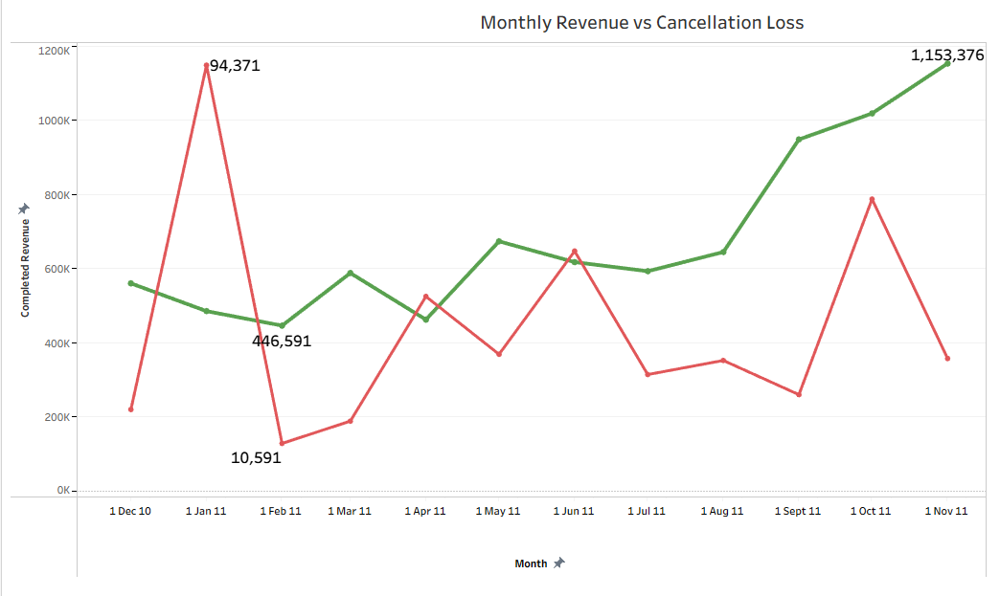

## Customer Sales Analytics Dashboard

# Project Overview

This project is a data analytics capstone project focused on analysing customer sales behaviour from a retail transaction dataset.

The original dataset used in this project was called customer_segmentation_data.csv.

The main goal of the project was to take raw customer transaction data and turn it into useful business insights. The project looks at sales revenue, cancellations, completed purchases, customer value, customer segmentation, product performance, country performance, and order value prediction.

The final output is an interactive Streamlit dashboard supported by Tableau visualisations and Python-based analysis. The project combines data cleaning, exploratory data analysis, customer segmentation, machine learning, and dashboard storytelling.

* Python
* Pandas
* Scikit-learn
* Tableau
* Streamlit
* Git / GitHub
* Jupyter Notebook
* AI assistant support for debugging, planning, and explanation

# Main Business Questions 

The project was designed around the following business questions:

* How much revenue did the business generate?
* How much revenue was lost through cancellations?
* Are sales increasing or decreasing over time?
* Which countries generate the most completed revenue?
* Which products generate the most completed revenue?
* Which customer groups are most valuable?
* Can previous customer behaviour help predict future order value?
* How can customer and invoice-level data be explored in an interactive dashboard?

These questions helped guide the full project, from data cleaning to the final dashboard design.

# Dataset Description

The dataset contains retail transaction data. Each row represents a product line inside an invoice. This means one invoice can appear more than once if a customer bought multiple products in the same order.

The main columns in the dataset were:

* InvoiceNo - the invoice or order number
* StockCode - the product code
* Description - the product description
* Quantity - the number of items purchased or cancelled
* InvoiceDate - the date and time of the transaction
* UnitPrice - the price per item
* CustomerID - an anonymous customer identifier
* Country - the country linked to the order

The dataset included normal purchases, cancelled invoices, missing values, repeated invoice rows, and customers with multiple purchases over time.

Because of this, the raw data needed to be cleaned and reshaped before it could be used for reliable analysis.

# Project Structure

The project was split into different Python files to keep the work organised.

* main.py handles the main cleaning process, separates purchases and cancellations, creates completed purchases, creates customer-level data, and creates the regression-ready dataset.
* sales_report.py creates the main sales metrics, monthly revenue data, cancellation analysis, country revenue, product revenue, and Tableau-ready CSV files.
* k-means_clustering.py creates customer status groups and compares them with K-Means clustering.
* regression_model.py trains and evaluates a regression model to predict order value.
* streamlit_gui.py builds the interactive Streamlit dashboard and embeds Tableau visualisations.
* tableau_data/ stores the CSV files used for Tableau charts and KPIs.

I used this structure because the project became easier to manage when each file had a clear purpose.

# Data Cleaning and Processing

The first major part of the project was cleaning the dataset.

At the start, the data looked like a normal sales dataset, but after checking it properly, I found several issues that could affect the analysis. These included missing customer IDs, cancelled invoices, negative quantities, repeated invoice rows, and large purchases that were later reversed by cancellations.

The main cleaning steps were:

* Loaded the original customer_segmentation_data.csv file.
* Used the correct CSV encoding because the file did not load correctly with the default encoding.
* Filled missing product descriptions with "Unknown".
* Removed rows with missing CustomerID values.
* Converted CustomerID into a cleaner integer format.
* Separated normal purchase orders from cancelled orders.
* Treated invoices beginning with "C" as cancelled orders.
* Removed invalid purchase rows where Quantity or UnitPrice were not positive.
* Created row-level revenue using Quantity * UnitPrice.
* Saved cleaned datasets to CSV files for later use.

This stage was important because the analysis depended on reliable customer IDs, valid purchases, and correctly separated cancellations.

# Handling Purchases, Cancellations and Completed Orders

One of the most important parts of the project was separating completed purchases from cancelled or reversed transactions.

Cancelled orders were identified by invoice numbers that started with "C". These were stored separately in cancelled_orders.csv.

At first, I calculated sales from the purchase data, but I noticed that some very large purchase invoices had matching cancellation invoices. This meant that some purchases looked like successful sales, but were later reversed.

If these were left in the completed sales data, they would make the business look like it earned more revenue than it actually did.

To fix this, I created a completed purchases dataset.

The matching process compared purchases and cancellations using:
* CustomerID
* invoice value
* rounded invoice value
* purchase date
* cancellation date
* a match number to avoid duplicate many-to-many matches

Only cancellations that happened after the original purchase were treated as possible reversals.

The reversed purchases were saved separately in:

* matched_reversed_invoices.csv

The final completed purchase data was saved in:

* completed_purchase_orders.csv

This made the revenue analysis more realistic because fully reversed purchases were no longer counted as successful completed sales.

# Why These Values Were Analysed

I chose the main values in the project because each one answered a different business question.

Revenue was analysed because it shows how much money the business generated.

Cancellation value was analysed because cancellations reduce real business performance. Gross revenue can look strong, but if large invoices are cancelled, the actual completed revenue is lower.

Average completed invoice value was analysed because it shows the typical value of a successful order. This is useful because total revenue can be affected by very large invoices.

Monthly revenue was analysed to see whether sales were increasing or decreasing over time.

Country revenue was analysed to understand which countries were producing the most completed sales.

Product revenue was analysed to identify which products were contributing most to the business.

Customer status was analysed because total sales figures do not explain customer behaviour on their own. A business needs to know which customers are valuable, loyal, new, inactive, or at risk.

# Feature Engineering

The raw dataset did not contain all the values needed for analysis, so I created new features.

The first feature was row-level revenue:

RowValue = Quantity * UnitPrice

This was used to calculate invoice values, product revenue, country revenue, monthly revenue, and cancellation value.

I also created customer-level features:

Frequency - how many unique invoices a customer had
Recency - how many days since the customer last purchased
MonetaryValue - total amount spent by the customer
AverageOrderValue - average value of the customer's orders
TotalQuantity - total number of items bought by the customer

For invoice-level analysis, I also created running customer features:

* OrderCount
* MonetaryValue
* AverageOrderValue

For the regression model, I created previous behaviour features:

* PreviousMonetaryValue
* PreviousAverageOrderValue
* PreviousOrderCount
* PreviousOrderValue
* DaysSincePreviousOrder

These previous behaviour features were important because the model should only use information that would be known before the current order.

# Sales Analysis

The sales analysis focused on completed purchases, cancellations, invoice values, and monthly revenue trends.

The main sales results were:

* Gross Purchase Revenue: €8,911,407.90
* Revenue Lost Through Cancellations: €611,342.09
* Net Revenue: €8,300,065.81
* Average Recorded Purchase Invoice Value: €480.87
* Average Cancelled Invoice Value: €167.31
* Average Completed Purchase Invoice Value: €464.75
* Total Invoices: 22,186
* Net Average Invoice Value: €374.11
* Largest Completed Purchase Invoice: €31,698.16
* Smallest Completed Purchase Invoice: €0.38
* Largest Cancelled Invoice: €168,469.60
* Smallest Cancelled Invoice: €0.39

The difference between gross purchase revenue and completed purchase revenue was important. Some purchases were later cancelled, so using only gross revenue would have overstated the sales performance.

This is why the final dashboard shows both revenue and cancellation impact.

# Monthly Sales Trend

Monthly sales were analysed to understand whether the business was growing or declining over time.

During this part of the project, I found that the final month appeared incomplete. Including this final incomplete month made the trend look misleading, so I excluded it from the growth comparison.

The completed monthly sales trend showed strong growth:

* First complete month revenue: €560,568.68
* Last complete month revenue: €1,153,375.54
* Revenue change: €592,806.86
* Revenue growth: 105.75%

This showed that sales increased strongly over the analysed period.

Cancellations were also analysed by month. They caused revenue loss, but they did not stop the overall positive sales trend.

