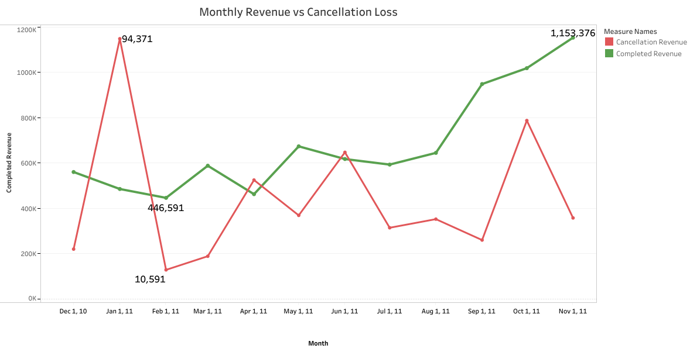
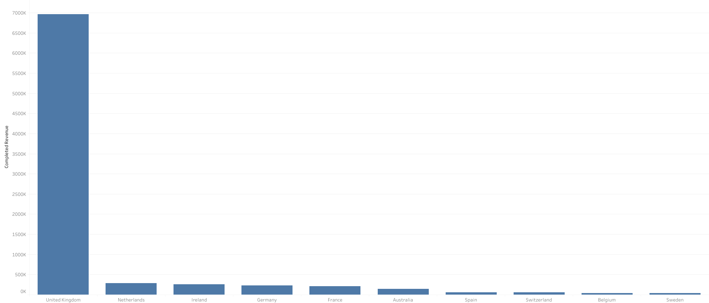
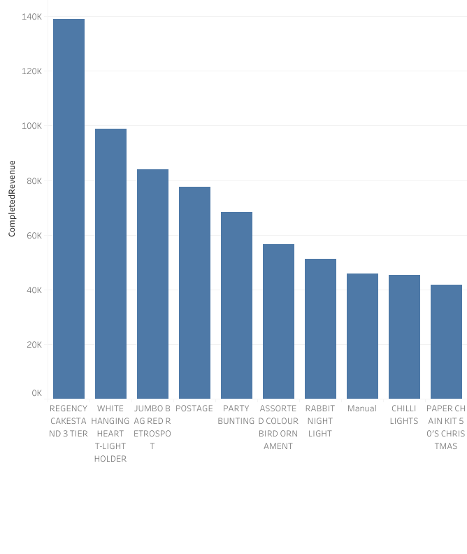
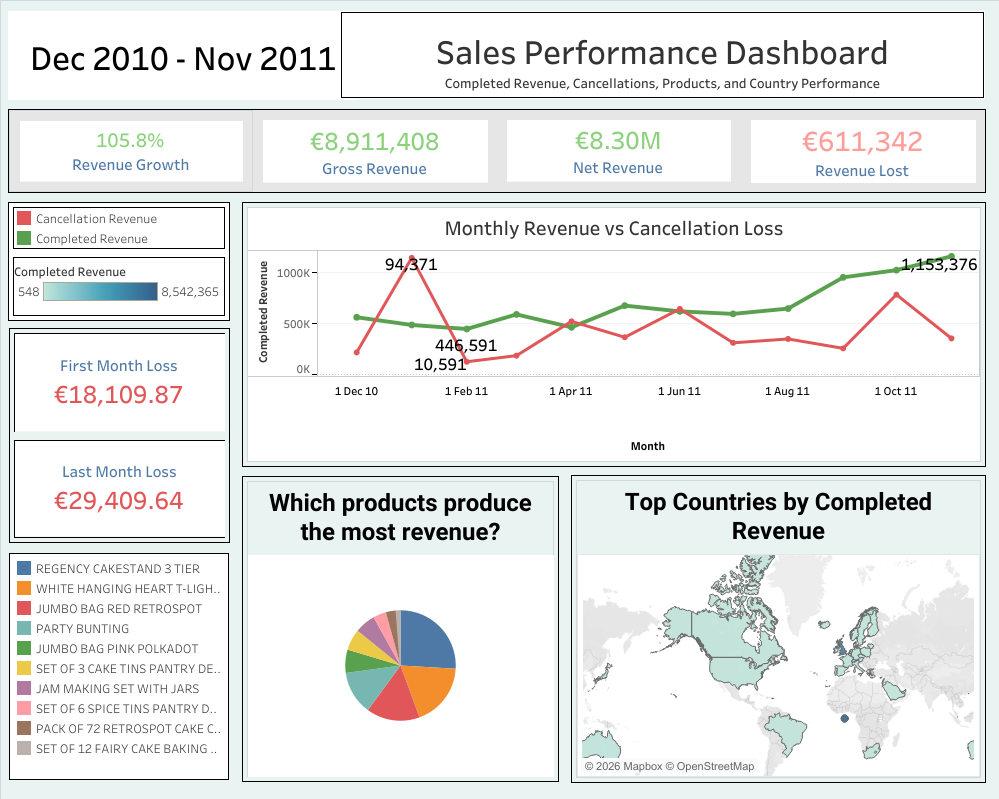
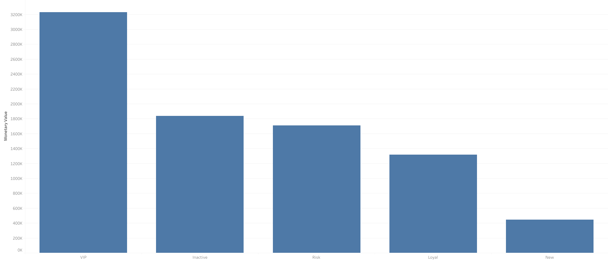
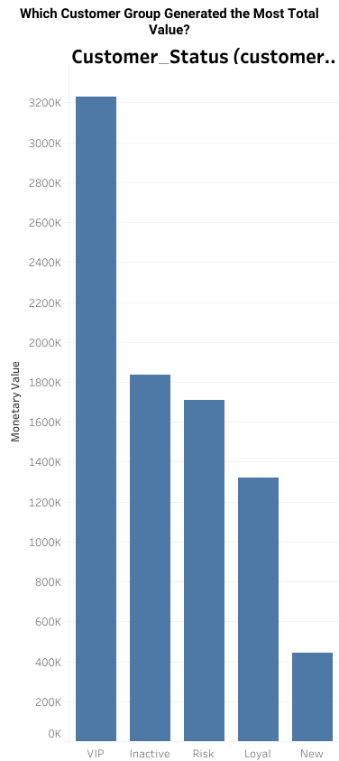
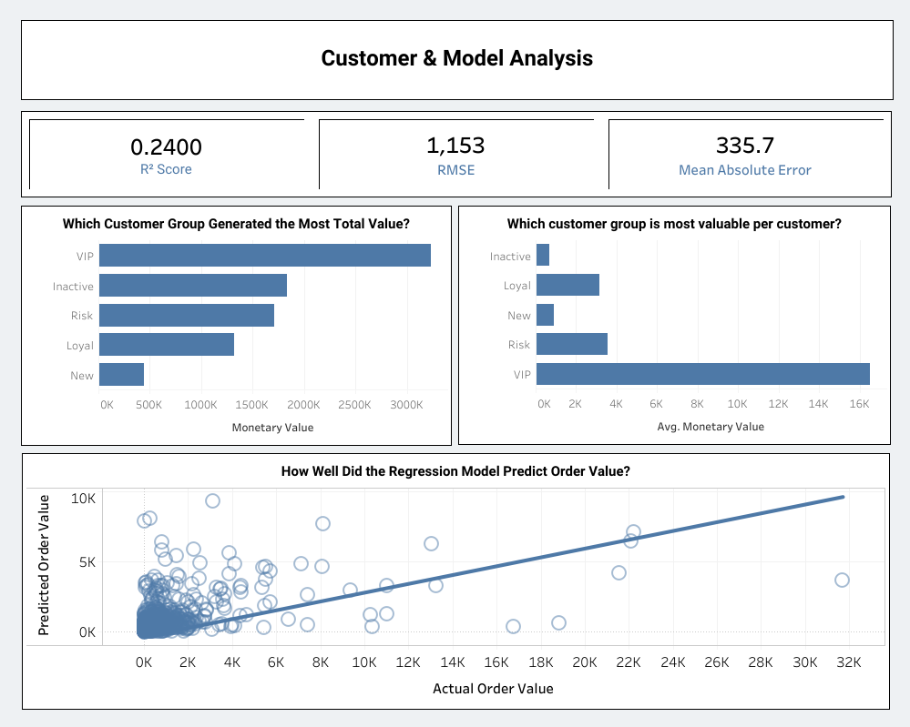

## Customer Sales Analytics Dashboard

# Project Overview

This project is a data analytics capstone project focused on analysing customer sales behaviour from a retail transaction dataset.

The original dataset used in this project was customer_segmentation_data.csv. The aim was to take raw customer transaction data and turn it into useful business insights around revenue, cancellations, completed purchases, customer value, customer segmentation, product performance, country performance, and order value prediction.

The final output is an interactive Streamlit dashboard supported by Tableau visualisations and Python analysis. The project combines data cleaning, exploratory data analysis, customer segmentation, machine learning, and dashboard storytelling.

The project was built using Python, Pandas, Scikit-learn, Tableau, Streamlit, Matplotlib, Git/GitHub, Jupyter Notebook, and AI assistant support for debugging, planning, and explanation.

# Main Business Questions 

The project was designed around the following business questions:

* How much revenue did the business generate?
* How much revenue was lost through cancellations?
* Are sales increasing or decreasing over time?
* Which countries generate the most completed revenue?
* Which products generate the most completed revenue?
* Which customer groups are most valuable?
* Can previous customer behaviour help predict future order value?
* How can customer and invoice-level data be explored in an interactive dashboard?

These questions helped guide the full project, from data cleaning to the final dashboard design.

# Dataset Description

The dataset contains retail transaction data. Each row represents a product line inside an invoice, meaning one invoice can appear more than once if a customer bought multiple products in the same order.

The main columns were:

* InvoiceNo - the invoice or order number
* StockCode - the product code
* Description - the product description
* Quantity - the number of items purchased or cancelled
* InvoiceDate - the date and time of the transaction
* UnitPrice - the price per item
* CustomerID - an anonymous customer identifier
* Country - the country linked to the order

The dataset included normal purchases, cancelled invoices, missing values, repeated invoice rows, and customers with multiple purchases over time. Because of this, the raw data needed to be cleaned and reshaped before it could be used for reliable analysis.

# Project Structure

The project was split into different Python files to keep the work organised.

* main.py handles the main cleaning process, separates purchases and cancellations, creates completed purchases, creates customer-level data, and creates the regression-ready dataset.* sales_report.py creates the main sales metrics, monthly revenue data, cancellation analysis, country revenue, product revenue, and Tableau-ready CSV files.
* sales_report.py creates sales metrics, monthly revenue data, cancellation analysis, country revenue, product revenue, and Tableau-ready CSV files.
* k-means_clustering.py creates customer status groups and compares them with K-Means clustering.
* regression_model.py trains and evaluates a regression model to predict order value.
* streamlit_gui.py builds the interactive Streamlit dashboard and embeds Tableau visualisations.
* tableau_data/ stores the CSV files used for Tableau charts and KPIs.

I used this structure because the project became easier to manage when each file had a clear purpose.

# Data Cleaning and Processing

The first major part of the project was cleaning the dataset. At the start, the data looked like a normal sales dataset, but after checking it properly, I found several issues that could affect the analysis. These included missing customer IDs, cancelled invoices, negative quantities, repeated invoice rows, and large purchases that were later reversed by cancellations.

The main cleaning steps were:

* Loaded the original customer_segmentation_data.csv file.
* Used the correct CSV encoding because the file did not load correctly with the default encoding.
* Filled missing product descriptions with "Unknown".
* Removed rows with missing CustomerID values.
* Converted CustomerID into a cleaner integer format.
* Separated normal purchase orders from cancelled orders.
* Treated invoices beginning with "C" as cancelled orders.
* Removed invalid purchase rows where Quantity or UnitPrice were not positive.
* Created row-level revenue using Quantity * UnitPrice.
* Saved cleaned datasets to CSV files for later use.

This stage was important because the analysis depended on reliable customer IDs, valid purchases, and correctly separated cancellations.

# Completed Purchases and Cancellations

One of the most important parts of the project was separating completed purchases from cancelled or reversed transactions.

Cancelled orders were identified by invoice numbers that started with "C". These were stored separately in cancelled_orders.csv.

During the sales analysis, I noticed that some large purchase invoices had matching cancellation invoices. This meant that some purchases looked like successful sales at first, but were later reversed. If these were left in the completed sales data, they would make the business look like it earned more revenue than it actually did.

To fix this, I created a completed purchases dataset. Purchases and cancellations were compared using CustomerID, invoice value, rounded invoice value, purchase date, cancellation date, and a match number to avoid duplicate many-to-many matches.

The reversed purchases were saved in matched_reversed_invoices.csv, and the final completed purchase data was saved in completed_purchase_orders.csv.

This made the revenue analysis more realistic because fully reversed purchases were no longer counted as successful completed sales.

# Why These Values Were Analysed

I chose the main values in the project because each one answered a different business question.

Revenue was analysed because it shows how much money the business generated.

Cancellation value was analysed because cancellations reduce real business performance. Gross revenue can look strong, but if large invoices are cancelled, the actual completed revenue is lower.

Average completed invoice value was analysed because it shows the typical value of a successful order. This is useful because total revenue can be affected by very large invoices.

Monthly revenue was analysed to see whether sales were increasing or decreasing over time.

Country revenue was analysed to understand which countries were producing the most completed sales.

Product revenue was analysed to identify which products were contributing most to the business.

Customer status was analysed because total sales figures do not explain customer behaviour on their own. A business needs to know which customers are valuable, loyal, new, inactive, or at risk.

# Feature Engineering

The raw dataset did not contain all the values needed for analysis, so I created new features.

The first feature was row-level revenue:

RowValue = Quantity * UnitPrice

This was used to calculate invoice values, product revenue, country revenue, monthly revenue, and cancellation value.

Customer-level features were also created:

* Frequency - how many unique invoices a customer had
* Recency - how many days since the customer last purchased
* MonetaryValue - total amount spent by the customer
* AverageOrderValue - average value of the customer's orders
* TotalQuantity - total number of items bought by the customer

For regression, I created previous behaviour features such as PreviousMonetaryValue, PreviousAverageOrderValue, PreviousOrderCount, PreviousOrderValue, and DaysSincePreviousOrder.

These previous behaviour features were important because the model should only use information that would be known before the current order.

# Sales Analysis

The sales analysis focused on completed purchases, cancellations, invoice values, and monthly revenue trends.

The main sales results were:

* Gross Purchase Revenue: €8,911,407.90
* Revenue Lost Through Cancellations: €611,342.09
* Net Revenue: €8,300,065.81
* Average Recorded Purchase Invoice Value: €480.87
* Average Cancelled Invoice Value: €167.31
* Average Completed Purchase Invoice Value: €464.75
* Total Invoices: 22,186
* Net Average Invoice Value: €374.11
* Largest Completed Purchase Invoice: €31,698.16
* Smallest Completed Purchase Invoice: €0.38
* Largest Cancelled Invoice: €168,469.60
* Smallest Cancelled Invoice: €0.39

The difference between gross purchase revenue and completed purchase revenue was important. Some purchases were later cancelled, so using only gross revenue would have overstated sales performance.

# Monthly Sales Trend

Monthly sales were analysed to understand whether the business was growing or declining over time.

During this part of the project, I found that the final month appeared incomplete. Including it made the trend look misleading, so I excluded it from the growth comparison.

The completed monthly sales trend showed strong growth:

* First complete month revenue: €560,568.68
* Last complete month revenue: €1,153,375.54
* Revenue change: €592,806.86
* Revenue growth: 105.75%

Cancellations caused revenue loss, but they did not stop the overall positive sales trend.

# Top Countries and Products

Country revenue was analysed to find out which countries generated the most completed sales. The United Kingdom generated most of the completed revenue. This was an important finding, but also a limitation because the country analysis was heavily dominated by one country.

Product revenue was also analysed to identify the highest earning products. This helped show which products contributed most to successful completed sales.

# Customer Segmentation

Customer segmentation was one of the most important parts of the project because sales totals do not explain what type of customers created the revenue.

Customers were grouped into:

* VIP
* Loyal
* Risk
* New
* Inactive

These groups were based on customer behaviour such as frequency, recency, average order value, and monetary value.

Customer status matters because it helps a business decide how different customers could be treated. For example, VIP customers could receive exclusive discounts or loyalty rewards, loyal customers could receive coupons to encourage repeat purchases, risk customers could receive re-engagement offers, new customers could receive welcome deals, and inactive customers could be reminded about what they are missing.

This makes the dashboard more useful for business decision-making because it turns raw numbers into customer groups that are easier to understand.

# Why Customer Status Matters

Customer status was included because sales totals only show part of the story. Knowing total revenue is useful, but it does not explain what type of customers are creating that revenue or how the business could respond to different customer groups.

By grouping customers into statuses such as VIP, Loyal, Risk, New, and Inactive, the dashboard becomes more useful from a business point of view.

Each group can support a different business action.

# VIP Customers

VIP customers are the highest-value customers. They buy often, buy recently, and spend strongly.

These customers are important because they already bring strong value to the business. A business could use this group for retention strategies such as:

* exclusive discounts
* early access to new products
* loyalty rewards
* personalised thank-you offers
* premium customer treatment

The goal with VIP customers would be to keep them engaged because losing them could have a larger impact on revenue.

# Risk Customers

Risk customers have bought frequently in the past but have not purchased recently.

This group matters because they may have been valuable before, but their recent behaviour suggests they could be drifting away.

A business could use this group for re-engagement campaigns such as:

* “we miss you” emails
* limited-time discounts
* reminders about new products
* personalised offers based on previous purchases
* feedback requests to understand why they stopped buying

This group is important because it may be cheaper to win back previous customers than to find completely new ones.

# New Customers

New customers have purchased recently but do not yet have a long buying history.

This group is useful because they are at the beginning of the customer relationship. A business could target them with:

* welcome offers
* reminders about new deals
* product recommendations
* first-time customer discounts
* emails encouraging a second purchase

The aim would be to turn new customers into repeat customers.

# Inactive Customers

Inactive customers do not currently show strong recent or frequent purchasing behaviour.

This group can still be useful because some customers may return if they are reminded about the business. A business could target inactive customers with:

* reminders about what they are missing
* comeback discounts
* seasonal offers
* new product updates
* simple reactivation campaigns

Not every inactive customer will return, but identifying this group helps the business understand which customers may need extra attention.

# Why This Adds Value

Customer status makes the analysis more practical because it turns raw customer numbers into business actions.

Instead of only saying a customer has a certain frequency, recency, or monetary value, the dashboard gives that customer a status that is easier to understand.

This could help a business decide:

* who to reward
* who to target with coupons
* who may need reminders
* who is at risk of leaving
* who has the potential to become more valuable

This makes the customer segmentation part of the project useful for customer retention, marketing, and sales planning.

# Customer Segmentation Methodology

Customer groups were created using quantile-based thresholds.

This means the thresholds came from the dataset itself instead of being chosen randomly.

The logic was:

* High frequency customers were more likely to be loyal.
* Low recency customers were more recent because fewer days had passed since their last purchase.
* High average order value customers spent more per order.
* High monetary value customers spent more overall.

This method made the segmentation easier to explain from a business point of view.

The goal was not just to create technical labels. The goal was to create customer groups that could be understood quickly in the dashboard.

# K-Means Clustering

K-Means clustering was tested as an unsupervised learning method.

The model used:

* Frequency
* Recency
* AverageOrderValue
* MonetaryValue

The data was scaled using StandardScaler because K-Means is affected by differences in scale. The model used five clusters so it could be compared with the five customer status groups.

K-Means was not treated as the final source of truth for customer status. It was used as a comparison to see whether the natural clusters in the data matched the rule-based customer groups. This was useful because business-defined customer groups and mathematical clusters do not always match perfectly.

# Regression Model

A regression model was created to test whether previous customer behaviour could help predict future order value.

The target value was OrderValue, and the final model used a RandomForestRegressor.

The model used these features:

* PreviousAverageOrderValue
* PreviousMonetaryValue
* PreviousOrderCount
* PreviousOrderValue
* DaysSincePreviousOrder
* Country

I used previous customer behaviour because it would not be realistic to use current order information to predict the current order value.

An early regression model produced a very high R² score of around 0.97. After checking the data more carefully, I realised this result was misleading because the regression data still contained product-level duplicate rows from the same invoice. This was a data leakage issue.

To fix this, I rebuilt the regression dataset so that each invoice appeared only once. This made the final score lower, but the result was more honest and reliable.

The final Random Forest regression model produced these results:

* Mean Absolute Error: 335.70
* Mean Squared Error: 1,328,666.84
* Root Mean Squared Error: 1,152.68
* R² Score: 0.24

The final model had limited predictive power. It predicted smaller order values better than larger high-value orders. This suggests that previous customer behaviour alone is not enough to accurately predict future order value.

In a real business, this type of model could still support planning by estimating which customers may place higher-value orders, which customer groups may generate stronger future revenue, and how marketing campaigns could be targeted.

# Regression Data Leakage Fix

One of the biggest bugs in the project happened during regression modelling.

An early regression model produced a very high R² score of around 0.97. At first, this looked like a very strong result.

After checking the data more carefully, I realised this result was misleading because the regression data still contained product-level duplicate rows from the same invoice.

Since one invoice could have multiple product rows, several rows shared the same InvoiceNo and OrderValue. This meant the model was probably learning repeated invoice information instead of properly predicting order value.

This was a data leakage issue.

To fix it, I rebuilt the regression dataset so that each invoice appeared only once.

This made the final model score lower, but the result was more honest and reliable.

This was an important learning point because a good model is not just the one with the highest score. It needs to be a result that can be trusted.

# Why Regression Was Used

The regression model was included to test whether previous customer behaviour could help predict future order value.

The idea was that if a business can estimate the likely value of a future order, it may be able to make better decisions around customer targeting, sales planning, and marketing campaigns.

The model used previous customer information such as:

* previous monetary value
* previous average order value
* previous order count
* previous order value
* days since previous order
* country

These features were used because they represent information that could be known before a future order happens.

# Business Use of Regression

In a real business, this type of model could help estimate which customers are more likely to place higher-value orders.

For example, if the business had last year’s customer behaviour and order data, a regression model could be trained on those figures and then used to help predict future order values.

This could support decisions such as:

* which customers should receive higher-value offers
* which customers may be worth targeting with premium product recommendations
* which customer groups may generate stronger future revenue
* how future sales targets could be estimated
* how marketing campaigns could be focused on customers with higher predicted order value

The model would not replace business judgement, but it could help support planning.

# Final Regression Results

The final Random Forest regression model produced these results:

* Mean Absolute Error: 335.70
* Mean Squared Error: 1,328,666.84
* Root Mean Squared Error: 1,152.68
* R² Score: 0.24

The final model had limited predictive power.

It predicted smaller order values better than larger high-value orders. Many expensive orders were under-predicted.

This suggests that previous customer behaviour alone is not enough to accurately predict future order value.

Even though the model was limited, it was still useful because it showed what the available data could and could not predict.

Future model improvements could include:

* product categories
* seasonality
* promotions or discounts
* customer segment
* more detailed product behaviour
* customer location patterns

# Ethics, Privacy and GDPR

The dataset uses anonymous customer IDs instead of customer names, phone numbers, emails, or addresses.

Even though the dataset does not contain direct personal information, customer transaction data can still be sensitive because it shows purchasing behaviour.

Ethical considerations included treating CustomerID as an anonymous identifier, avoiding any attempt to identify individual customers, being careful when interpreting customer groups, avoiding unfair assumptions based only on spending behaviour, presenting model results honestly, and explaining limitations clearly.

If this project were used in a real business, GDPR and data governance rules would need to be followed. This would include secure data storage, controlled access, data minimisation, clear retention rules, and transparency around how customer data is used.

# Streamlit Dashboard

The Streamlit dashboard brings the project together into one interactive app.

The app includes:

* Home
* Customer Order Search
* Sales Report
* Customer Segmentation
* Regression Model
* About

The Home page introduces the project and explains the main business questions.

The Customer Order Search page allows users to search by customer ID and invoice number. It shows customer status, recency, total orders, total spent, invoice rows, and a popup order summary.

The Sales Report page shows the main revenue results, cancellation impact, monthly sales trends, top countries, and top products.

The Customer Segmentation page shows customer groups, customer value charts, and a filterable customer table.

The Regression Model page shows model metrics and an actual vs predicted order value chart.

The dashboard was designed to make the analysis easier to explore instead of only showing static results.

# Tableau Visualisations

Tableau was used to create the main visual charts and KPI cards.

The Tableau charts were embedded inside Streamlit so that the app could combine Tableau's visual design with Streamlit's interactivity.

The Tableau visuals include:

* revenue KPI cards
* cancellation KPI cards
* monthly sales trend
* completed revenue vs cancellation loss
* top 10 countries by completed revenue
* top 10 products by completed revenue
* customer segmentation KPIs
* customer value charts
* actual vs predicted regression chart

Some Tableau Public embed formatting issues remained, such as small toolbar or spacing limitations. These were accepted as visual limitations because the charts still communicated the analysis clearly.

# Bugs, Challenges and Fixes
Several issues came up during the project:

* The original dataset did not load correctly with the default CSV settings, so I used the correct encoding.
* Rows with missing CustomerID values were removed because customer-level analysis needed reliable identifiers.
* Cancelled orders had to be separated from normal purchases because they represented revenue loss rather than completed sales.
* Some large purchase invoices were later matched by cancellation invoices, so reversed purchases were removed from the completed purchase dataset.
* Product-level duplicate rows caused a data leakage issue in the first regression model, so the regression dataset was rebuilt at invoice level.
* Tableau Public embeds created some layout issues inside Streamlit.

These challenges helped improve the project because they forced me to check whether the analysis was reliable instead of just accepting the first result.

# Limitations

This project has several limitations:

* The dataset covers a limited time period.
* Some rows had missing CustomerID values and had to be removed.
* Product descriptions were not always clean or standardised.
* The United Kingdom dominated the dataset, which affected country comparisons.
* The final month appeared incomplete and had to be excluded from the trend comparison.
* The regression model had limited predictive power.
* High-value orders were difficult for the model to predict.
* Previous customer behaviour alone was not enough for strong prediction.
* K-Means clusters did not perfectly match business-defined customer groups.
* Tableau Public embeds created some visual formatting limitations.
* The project used static CSV files rather than a live database.

These limitations are important because they show that the results should be interpreted carefully.

# Installation and Setup

Install the required packages:

pip install pandas scikit-learn matplotlib streamlit streamlit-option-menu

Run the Streamlit app:

streamlit run streamlit_gui.py

The Tableau visuals are embedded from Tableau Public, so an internet connection may be required for the visuals to load correctly.

# Credits

Dataset source: Online retail/customer transaction dataset used for educational analysis.
link to kaggle dataset ----> 'https://www.kaggle.com/code/farzadnekouei/customer-segmentation-recommendation-system'

Tools and libraries used:

Python
Pandas
Scikit-learn
Matplotlib
Tableau
Streamlit
Streamlit Option Menu
Git / GitHub
Jupyter Notebook